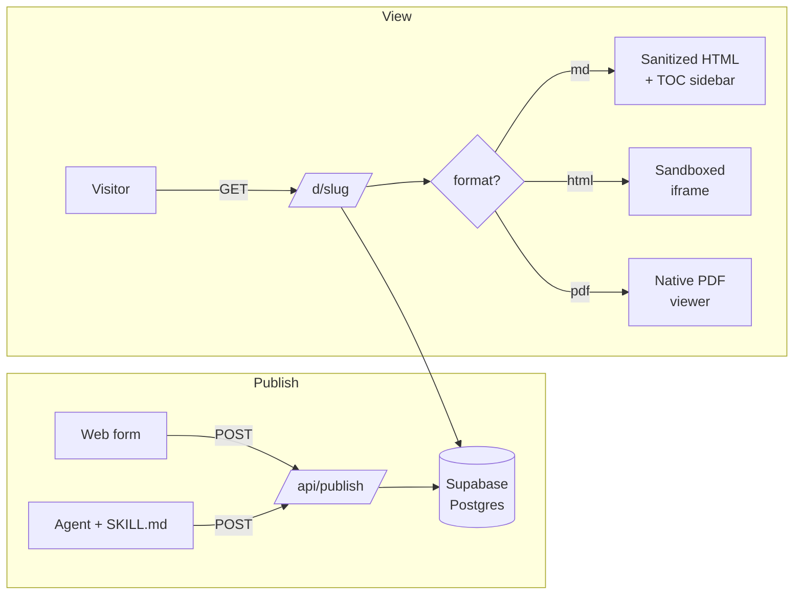

<div align="center">

# echo

**The agent-native way to share HTML, Markdown, and PDF documents.**

Drop a file, get a short, optionally password-protected link.  
Built for AI agents and humans — no hosting infrastructure required.

[**Live demo →**](https://echo-kappa-peach.vercel.app) · [**SKILL.md**](https://echo-kappa-peach.vercel.app/skill.md)

[](./LICENSE)
[](https://nextjs.org)
[](https://www.typescriptlang.org)
[](https://supabase.com)
[](https://vercel.com)

</div>

---

## Screenshot

<p align="center">
  
</p>

<sub>*To make this image render, drop a screenshot of the homepage at `docs/screenshot.png`. Open the live demo at desktop width and capture the brand wordmark, agent callout, and form card.*</sub>

---

## Why echo

You generate HTML reports with Claude. Markdown writeups with Cursor. PDFs from a hundred different tools. Sharing them means either pasting raw content into chat (loses fidelity, can't password-protect), spinning up your own Vercel/Netlify project (slow, overkill for a single doc), or using something like Tiiny.host (works, but not built for AI workflows).

echo is the third option — purpose-built for the *"I just generated this, give me a link"* workflow, with a first-class agent surface (`SKILL.md`) so any agent runtime can publish without an MCP server.

## Features

| | |
|---|---|
| 📤 **Drop or paste** | Drag `.md`, `.html`, or `.pdf` files into the homepage, or paste raw Markdown/HTML |
| 📝 **Markdown** | Renders as a clean article in a paper-style card with a sidebar TOC and heading anchors |
| 🌐 **HTML** | Runs inside a sandboxed iframe (`sandbox="allow-scripts"`) — scripts can't escape to the parent origin |
| 📄 **PDF** | Streams to the browser's native PDF viewer via a dedicated bytes route |
| 🔒 **Password gate** | bcrypt-hashed, HMAC-signed unlock cookie, per-doc 24h expiry |
| 🔍 **SEO opt-in** | Per-doc `indexable` flag — default `noindex` (docs are share-by-link) |
| 🤖 **`SKILL.md`** | Drop-in instructions at `/skill.md` so Claude, Cursor, and other agents can publish without an MCP server |

## Architecture



## Stack

- **[Next.js 15](https://nextjs.org)** (App Router) on **[Vercel](https://vercel.com)**
- **[Supabase](https://supabase.com)** Postgres for storage
- **[marked](https://marked.js.org)** + **[sanitize-html](https://github.com/apostrophecms/sanitize-html)** for Markdown
- **[bcryptjs](https://github.com/dcodeIO/bcrypt.js)** + Node `crypto` HMAC for password gating
- **[Vercel Analytics](https://vercel.com/docs/analytics)** + **[Speed Insights](https://vercel.com/docs/speed-insights)**

## Quick start

### 1. Clone and install

```bash
git clone https://github.com/caglarbozkurt/echo.git
cd echo
npm install
```

### 2. Create a Supabase project

Sign up at [supabase.com](https://supabase.com) and create a new project (free tier is enough).

- Open **SQL Editor** → paste the contents of [`db/schema.sql`](./db/schema.sql) → run
- **Settings → API** → copy the **Project URL** and **secret key** (`sb_secret_…`)

### 3. Environment

```bash
cp .env.example .env.local
```

Fill in `.env.local`:

```bash
SUPABASE_URL=https://<your-project>.supabase.co
SUPABASE_SERVICE_ROLE_KEY=sb_secret_…
ECHO_COOKIE_SECRET=…   # openssl rand -hex 32
NEXT_PUBLIC_BASE_URL=http://localhost:3000
```

### 4. Run

```bash
npm run dev
```

Open [http://localhost:3000](http://localhost:3000).

## Deploy to Vercel

1. Push your fork to GitHub
2. [vercel.com](https://vercel.com) → **Add New** → **Project** → import the repo
3. Add the same four env vars under **Settings → Environment Variables**
4. Deploy. After the first deploy, set `NEXT_PUBLIC_BASE_URL` to your assigned production URL and redeploy once so the API responses and `SKILL.md` reference the correct host

## API

`POST /api/publish` accepts JSON. **No authentication in v0** — same risk profile as the web form (also open). Per-user tokens ship with v1 accounts.

```bash
curl -X POST https://<your-domain>/api/publish \
  -H "Content-Type: application/json" \
  -d '{
    "content": "# Hello",
    "format": "md",
    "password": "optional",
    "title": "optional",
    "indexable": false
  }'
# → { "slug": "abc123xy", "url": "https://<your-domain>/d/abc123xy" }
```

PDFs are sent base64-encoded:

```bash
curl -X POST https://<your-domain>/api/publish \
  -H "Content-Type: application/json" \
  -d "{
    \"content\": \"$(base64 -i my.pdf)\",
    \"format\": \"pdf\",
    \"title\": \"My PDF\"
  }"
```

Full parameter reference at [`/skill.md`](https://echo-kappa-peach.vercel.app/skill.md).

## Use from an AI agent

`SKILL.md` is served dynamically at `/skill.md` with the production URL substituted in. It follows Anthropic's skill format, so any agent runtime that reads skills will pick it up:

```bash
mkdir -p ~/.claude/skills/echo
curl -sS https://echo-kappa-peach.vercel.app/skill.md \
  -o ~/.claude/skills/echo/SKILL.md
```

In a new session, asking *"publish this writeup to echo"* will auto-trigger the skill — Claude will call `/api/publish` and return the share URL.

## Project layout

<details>
<summary><b>Click to expand the file tree</b></summary>

```
src/
├── app/
│   ├── page.tsx                 # Homepage: form, agent callout, log feed
│   ├── layout.tsx               # Metadata, OG tags, Analytics
│   ├── actions.ts               # Server action for the web form
│   ├── api/publish/route.ts     # JSON publish endpoint
│   ├── d/[slug]/
│   │   ├── page.tsx             # Render (md article / html iframe / pdf iframe)
│   │   └── pdf/route.ts         # PDF byte stream (Content-Type: application/pdf)
│   ├── published/[slug]/page.tsx
│   └── skill.md/route.ts        # Dynamic SKILL.md with host substitution
├── components/
│   ├── PublishForm.tsx          # Client: tabs, dropzone, format detection
│   ├── BrandHeader.tsx          # Sticky masthead with copy-link
│   ├── TableOfContents.tsx      # MD doc sidebar
│   ├── CopyButton.tsx
│   └── Footer.tsx
├── lib/
│   ├── supabase.ts              # Server-only client (service role)
│   ├── db.ts                    # getDocBySlug / insertDoc
│   ├── auth.ts                  # bcrypt + HMAC unlock tokens
│   ├── markdown.ts              # marked + sanitize-html, heading IDs, TOC
│   └── baseUrl.ts
└── config/log.ts                # Curated homepage log feed
db/
├── schema.sql                   # Single `documents` table
└── migrations/                  # Idempotent ALTER scripts
public/
├── example.md                   # The "what is echo" doc
└── robots.txt                   # /d/ crawlable, per-page noindex by default
```

</details>

## License

[MIT](./LICENSE) — built by [Caglar Bozkurt](https://github.com/caglarbozkurt).
